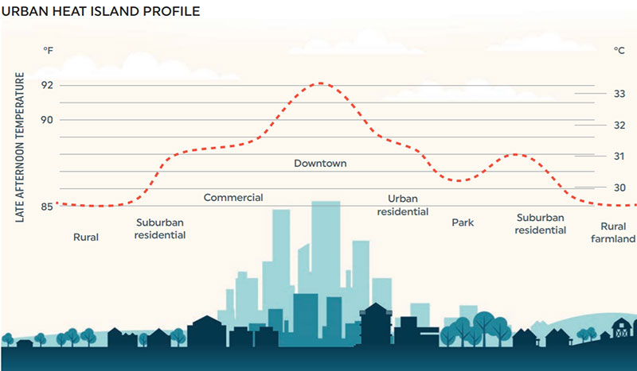

# uhi

An [urban heat island (UHI)](https://en.wikipedia.org/wiki/Urban_heat_island) is a phenomenon whereby the temperature in an urban area is significantly warmer than surrounding rural landscapes. Due to replacement of natural surfaces with concrete and asphalt – materials of high thermal capacity and low albedo – the surface energy budget of urban centres is often significantly different compared to neighbouring suburban / rural areas. During daytime, reduced levels of sensible heat convection and evaporative cooling contribute to the UHI effect, while at night-time, absorbed solar radiation re-emitted as thermal energy from buildings and road surfaces is the primary mechanism underlying UHI formation.

Better characterization and understanding of the UHI effects are critically important to support urban planning and policy development. Satellite thermal remote sensing provides a cost-effective mechanism for monitoring spatiotemporal dynamics of urban surface temperatures simultaneously across cities worldwide. It is an effective tool for evaluating drivers of UHI formation, modelling its diurnal and seasonal patterns and assessing its long-term trajectory - and therefore designing and implementing city-specific mitigation strategies.

To quantify urban heat island effect from satellite thermal image analysis, individual pixels are classified as urban and non-urban based on their location and predominant land cover type. Having classified pixels into two subsets, satellite derived surface UHI indicator is typically calculated as the difference between mean urban land surface temperature and mean non-urban land surface temperature.

Notebooks in this repository demonstrate automated calculation of seasonal surface UHI effect impacting the city of Bristol using archived time series of Landsat 8/9 thermal datasets accessed via (Sentinel-Hub)[https://www.sentinel-hub.com/] platform / APIs.  

### Useful Links
------------
NASA ARSET Presentation: [Satellite Remote Sensing for Urban Heat Islands](https://appliedsciences.nasa.gov/sites/default/files/2020-11/UHI_Part1_v5.pdf).
